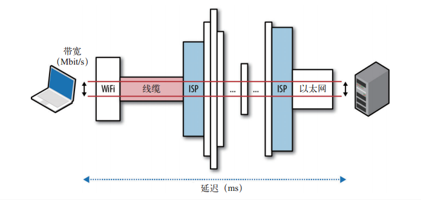
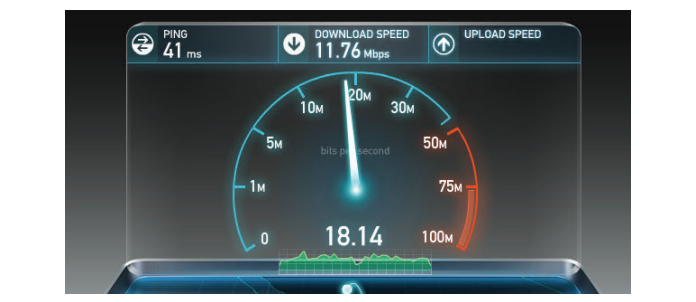

# 第 一 部 分
**网络技术概览**

## 第 1 章
**延迟与带宽**
### 1.1　速度是关键
近几年来， WPO（ Web Performance Optimization， Web 性能优化）产业从无到有，
快速增长，充分说明用户越来越重视速度方面的用户体验。而且，在我们这个节奏
越来越快、联系越来越紧密的世界，追求速度不仅仅是一种心理上的需要，更是一
种由现实事例驱动的用户需求。很多在线公司的业绩已经证实：
-  网站越快，用户的黏性越高；
-  网站越快，用户忠诚度更高；
-  网站越快，用户转化率越高。

简言之，速度是关键。要提高速度，必须先了解与之相关的各种因素，以及根本性
的限制。本章主要介绍对所有网络通信都有决定性影响的两个方面：延迟和带宽
（图 1-1）。

- 延迟
分组从信息源发送到目的地所需的时间。
- 带宽
逻辑或物理通信路径最大的吞吐量。




理解了带宽和延迟之间的关系，接下来就可以进一步探讨 TCP、 UDP，以及构建于
它们之上的所有应用层协议的内部构造和性能特征。  

##### 为减少跨大西洋的延迟而铺设 Hibernia Express 专线
>在金融市场上，很多常用交易算法首要的考虑因素就是延迟，因为几 ms 的差距可
能导致数百万美元的收益或损失。  
2011 年初，华为与 Hibernia Atlantic 开始合作铺设一条横跨大西洋，连接伦敦和
纽约的近 5000 km 的海底光缆（ Hibernia Express）。铺设这条海底光缆的唯一目
的，就是减少城市间的路由，（相对于使用其他横跨大西洋的线路）为交易商节
省 5 ms 的延迟。开通运营后，这条光缆将只由金融机构使用，耗资预计达 4 亿
美元。  
简单计算一下，不难得出节省 1 ms 的成本是 8000 万美元。延迟的代价由此可见
一斑。  
### 1.2　延迟的构成
延迟是消息（ message）或分组（ packet）从起点到终点经历的时间。这个定义简单明
了，但却掩盖了很多有用的信息。事实上，任何系统都有很多因素可能影响传送消息
的时间。因此，弄清楚这些因素是什么，以及它们如何影响性能是最重要的。
下面看看路由器这个负责在客户端和服务器之间转发消息的设备，会牵涉哪些影响
延迟的因素。

- 传播延迟
消息从发送端到接收端需要的时间，是信号传播距离和速度的函数
- 传输延迟
把消息中的所有比特转移到链路中需要的时间，是消息长度和链路速率的函数
- 处理延迟
处理分组首部、检查位错误及确定分组目标所需的时间
- 排队延迟
到来的分组排队等待处理的时间  

以上延迟的时间总和，就是客户端到服务器的总延迟时间。传播时间取决于距离和
信号通过的媒介，另外传播速度通常不超过光速。而传输延迟由传输链路的速率决
定，与客户端到服务器的距离无关。举个例子，假设有一个 10 MB 的文件，分别通
过两个链路传输，一个 1 Mbit/s，另一个 100 Mbit/s。在 1 Mbit/s 的链路上，需要花
10 s，而在 100 Mbit/s 的链路上，只需 0.1 s。  

接着，分组到达路由器。路由器必须检测分组的首部，以确定出站路由，并且还可
能对数据进行检查，这些都要花时间。由于这些检查通常由硬件完成，因此相应的
延迟一般非常短，但再短也还是存在。最后，如果分组到达的速度超过了路由器的
处理能力，那么分组就要在入站缓冲区排队。数据在缓冲区排队等待的时间，当然
就是排队延迟。  

每个分组在通过网络时都会遇到这样或那样的延迟。发送端与接收端的距离越远，
传播时间就越长。一路上经过的路由器越多，每个分组的处理和传输延迟就越多。
最后，网络流量越拥挤，分组在入站缓冲区中被延迟的可能性就越大。  

##### 本地路由器的缓冲区爆满
>缓冲区爆满（ Bufferbloat）是 Jim Gettys 在 2010 年发明的一个术语，是排队延迟
影响网络整体性能的一个形象的说法。
造成这个问题的原因主要是如今市面上的路由器都会配备很大的入站缓冲区，以便
“不惜一切代价”避免丢包（分组）。可是，这种做法破坏了 TCP 的拥塞预防机制
（ congestion avoidance，下一章将介绍），导致网络中产生较长且可变的延迟时间。
为解决这个问题，有人提出了新的 CoDel 主动队列管理算法，且已经在 Linux 内
核 3.5 以上版本中实现。如果想了解更多内容，可以参考 ACM 的一篇论文，搜索
“Controlling Queue Delay”就能找到。

### 1.3　光速与传播延迟
正如爱因斯坦在他的狭义相对论里所说的，光速是所有能量、物质和信息运动所能
达到的最高速度。这个结论给网络分组的传播速度设定了上限。  

好消息是光速极快，每秒能达到 299 792 458 米（大约 30 万公里）。但是，别忘了
还有个但是，这是光在真空中的传播速度。而网络中的分组是通过铜线、光纤等介
质传播的，这些介质会导致传播速度变慢。光速与分组在介质中传播速度之比，叫
做该介质的折射率。这个值越大，光在该介质中传播的速度就越慢。  

传播分组的光纤，大多数折射率从 1.4 到 1.6 不等。不过，我们也在逐渐改进传播
材料的质量，从而不断降低折射率。为简单起见，我们大都假定光通过光纤的速度
约为每秒 200 000 000 米，对应的折射率约为 1.5。值得一提的是，我们已经能够把
折射率降低到最大速度的一个很小的常数因子的范围内了！仅此就堪称一项了不起
的成就。  

当然，我们还是不太习惯以光速为参照来思考，因此表 1-1 给出了几个例子，以便
我们能够直观地想象。  


表1-1：真空与光纤中的信号延迟
|路线 |距离（km）| 时间：光在真空中 | 时间：光在光纤中 |光纤中的往返时间（RTT）|
| :-------- | --------:| :------: | :-------- | :-------- |
|纽约到旧金山 |4148 |14 ms |21 ms| 42 ms|
|纽约到伦敦| 5585 |19 ms |28 ms| 56 ms|
|纽约到悉尼 |15993 |53 ms |80 ms |160 ms|
|赤道周长 |40075 |133.7 ms| 200 ms| 400 ms|

光速已经很快了，尽管如此从纽约到悉尼的一个往返（ RTT）也要花 160 ms。事实
上，以上这些数字都是理想情况下的结果，因为我们假设传送分组的光缆恰好是连
接两个城市的一条完美的大弧形线路（地球表面两点间最短的距离）。而实际上纽约
和悉尼之间是没有这样一条线路的，分组旅行的距离比这要长得多。这条线路中的
每一跳都会涉及寻路、处理、排队和传输延迟。结果呢，纽约到悉尼的实际 RTT，
大约在 200~300 ms 之间。即便如此，还是很快的，对吧？  

我们都不习惯用 ms 来度量身边的事物，但研究表明：在软件交互中，哪怕 100~
200 ms 左右的延迟，我们中的大多数人就会感觉到“拖拉”；如果超过了 300 ms 的
门槛，那就会说“反应迟钝”；而要是延迟达到 1000 ms（ 1s）这个界限，很多用户
就会在等待响应的时候分神，有人会想入非非，有人恨不得忙点别的什么事儿。
结论很简单：要想给用户最佳的体验，而且保证他们全神贯注于手边的任务，我们
的应用必须在几百 ms 之内响应。这几乎没有给我们——特别是网络，留出多少出
错的余地。若要成功，必须认真对待网络延迟，在每个开发阶段都为它设立明确的
标准。  

> CDN（ Content Delivery Network，内容分发网络）服务的用途很多，但最
重要的就是通过把内容部署在全球各地，让用户从最近的服务器加载内容，
大幅降低传播分组的时间。  

或许我们不能让数据传输得更快，但我们可以缩短服务器与用户之间的距
离！把数据托管到 CDN 能够显著提高性能。  

### 1.4　延迟的最后一公里
你说怪不怪，延迟中相当大的一部分往往花在了最后几公里，而不是在横跨大洋或
大陆时产生的，这就是所谓的“最后一公里”问题。为了让你家或你的办公室接入
互联网，本地 ISP 需要在附近安装多个路由收集信号，然后再将信号转发到本地的
路由节点。连接类型、路由技术和部署方法五花八门，分组传输中的这前几跳往往
要花数十 ms 时间才能到达 ISP 的主路由器！根据美国联邦通信委员会（ FCC）发
布于 2012 年年中的《美国宽带测量报告》（ Measuring Broadband America），在通
信高峰的几个小时内：
>光纤入户服务的平均往返时间为 18 ms， 有线电视线路上网平均为 26 ms，
DSL 专线平均为 43 ms。
——FCC， 2012 年 7 月

这里 18~43 ms 的延迟测量的还只是 ISP 核心网络中与用户最近的节点，此时分组甚
至都还没有启程呢！ FCC 的报告只反映了美国的情况，但最后一公里的延迟却是世
界任何一个角落的互联网提供商共同面临的问题。如果你好奇，那只要一条简单的
traceroute 命令，就能知道上网服务商的拓扑结构和速度。
```bash
$> traceroute google.com
traceroute to google.com (74.125.224.102), 64 hops max, 52 byte packets
//第 1 跳:本地无线路由器
1 10.1.10.1 (10.1.10.1) 7.120 ms 8.925 ms 1.199 ms 
2 96.157.100.1 (96.157.100.1) 20.894 ms 32.138 ms 28.928 ms
3 x.santaclara.xxxx.com (68.85.191.29) 9.953 ms 11.359 ms 9.686 ms
4 x.oakland.xxx.com (68.86.143.98) 24.013 ms 21.423 ms 19.594 ms
5 68.86.91.205 (68.86.91.205) 16.578 ms 71.938 ms 36.496 ms
6 x.sanjose.ca.xxx.com (68.86.85.78) 17.135 ms 17.978 ms 22.870 ms
7 x.529bryant.xxx.com (68.86.87.142) 25.568 ms 22.865 ms 23.392 ms
8 66.208.228.226 (66.208.228.226) 40.582 ms 16.058 ms 15.629 ms
9 72.14.232.136 (72.14.232.136) 20.149 ms 20.210 ms 18.020 ms
10 64.233.174.109 (64.233.174.109) 63.946 ms 18.995 ms 18.150 ms
//第 11 跳：谷歌服务器
11 x.1e100.net (74.125.224.102) 18.467 ms 17.839 ms 17.958 ms 
```

分组从森尼维耳市开始，跳到圣克拉拉，经过奥克兰，返回圣何塞，又被路由到
“ 529 Bryant”数据中心，从那儿才开始向谷歌服务器进发，最终在第 11 跳到达目
的地。整个行程大约 18 ms，所有延迟都算上了，还不错。但与此同时，我们的分
组几乎穿越了大半个美国本土！  

最后一公里的延迟与提供商、部署方法、网络拓扑，甚至一天中的哪个时段都有很
大关系。作为最终用户，如果你想提高自己上网的速度，那选择延迟最短的 ISP 是
最关键的。  

大多数网站性能的瓶颈都是延迟，而不是带宽！要理解为什么，需要明白
TCP 和 HTTP 协议的细节，这也是本书后面几章要讨论的。假如你现在就
着急知道，可以直接翻到 10.3.1 节“更多带宽其实不（太）重要”。
##### 使用 traceroute 测量延迟
>traceroute 是一个简单的网络诊断工具，可以列出分组经过的路由节点，以及它在
IP 网络中每一跳的延迟。为找到每一跳的节点，它会向目标发送一系列分组，每
次发送时的“跳数限制”都会递增（ 1、 2、 3，等等）。在达到跳数限制时，中间
的节点会返回 ICMP Time Exceeded 消息， traceroute 根据这个消息可以计算出每
一跳的延迟。  
在 Unix 平台上，可以在命令行运行 traceroute。而在 Windows 平台中，相应的
命令叫 tracert。

### 1.5　网络核心的带宽
光纤就是一根“光导管”，比人的头发稍微粗一点，专门用来从一端向另一端传送光
信号。金属线则用于传送电信号，但信号损失、电磁干扰较大，同时维护成本也较
高。这两种线路我们的数据分组很可能都会经过，但一般长距离的分组传输都是通
过光纤完成的。  

通过波分复用（ WDM， Wavelength-Division Multiplexing）技术，光纤可以同时传
输很多不同波长（信道）的光，因而具有明显的带宽优势。一条光纤连接的总带宽，
等于每个信道的数据传输速率乘以可复用的信道数。 

到 2010 年初，研究人员已经可以在每个信道中耦合 400 多种波长的光线，最大容
量可达 171 Gbit/s，而一条光纤的总带宽能够达到 70 Tbit/s ！如此大的吞吐量如果
换成铜线（传输电信号）可能需要几千条。自然地，像两个大陆间的海底数据传输，
现在都已经使用光纤连接了。每条光缆会封装几条光纤（常见的是 4 条），折算出来
的带宽容量能达到每秒几百太比特。  
### 1.6　网络边缘的带宽
构成因特网核心数据路径的骨干或光纤连接，每秒能够移动数百太比特信息。然
而，网络边缘的容量就小得多了，而且很大程度上取决于部署技术，比如拔号连接、
DSL、电缆、各种无线技术、光纤到户，甚至与局域网路由器的性能也有关系。用
户可用带宽取决于客户端与目标服务器间最低容量连接（参见图 1-1）。  

Akamai 技术公司在全球部署了 CDN，服务器遍及世界各地，而且每季度都会发
布一份免费的带宽平均速度报告（由他们的服务器测量），地址为： http://www.
akamai.io。表 1-2 中展示的是 2012 年年中监测到的世界各地的平均带宽。
表1-2： 2012年年中Akamai公司服务器的平均带宽
|排名| 国家和地区| 平均Mbit/s |年增长|
| :-------- | --------:| :------: | :-------- |
|-| 全球| 3.1 |17%|
|1| 韩国| 14.2 |-10%|
|2| 日本| 11.7 |6.8%|
|3| 香港| 10.9 |16%|
|4| 瑞士| 10.1 |24%|
|5| 荷兰| 9.9| 12%|
|… ||||
|9| 美国| 8.6 |27%|
以上数据不包括移动网络的流量，这一块我们稍后还要详细讨论。目前，可以肯定
移动网络的速度差异很大，而且一般都更慢。即便如此， 2012 年上半年全球宽带的
带宽也只有 2.6 Mbit/s ！韩国以 15.7 Mbit/s 的平均带宽位居第 1，美国的 6.7 Mbit/s
位列第 12 名。  

为了更好地理解这些数字，我们举个例子：视频网站的高清视频流，根据分辨率高
低以及编解码器不同，可能需要 2~10 Mbit/s。因此，一般用户在网络末端观看低分
辨率的流视频几乎就可以消耗掉其所有带宽。对于一个可能会有多人同时上网的家
庭而言，这个结果并不理想。  

搞清楚每个用户的带宽瓶颈通常不是件容易的事，却又非常重要。同样，为了满足
大家的好奇心，推荐一个在线服务吧： Ookla 运营的 http://speedtest.net（图 1-2），
可以测试客户端到某个本地服务器的上传和下载速度。在后面讨论 TCP 的时候，我
们会解释为什么选择本地服务器很重要。在这些服务器上运行测试可以验证你的
ISP 在广告中吹嘘的速度。  



虽然与 ISP 的高带宽连接是必要的，但这个高带宽并能不保证端到端的传输速度。
由于请求密集、硬件故障、网络攻击，以及其他很多原因，网络的某个中间节点随
时都有可能发生拥塞。吞吐量和延迟波动大是因特网固有的特点。要预见、控制、
适应瞬息万变的“网络天气”可不容易。

### 1.7　目标： 高带宽和低延迟
人们对高带宽的需求增长迅速，很大程度是受到了在线流视频的拉动，目前的视频
流量已经占到全部因特网流量的一半以上。好在，虽然不一定很便宜，但我们有很
多方法可以提高容量。比如，可以在光纤链路中部署更多光纤、在拥塞的路由之间
铺设更多线路，甚至是改进 WDM 技术，以便让现有连接能够传输更多数据。  

电信市场研究及咨询公司 TeleGeography 估计，我们到 2011 年（平均）只使用了海
底光缆可用容量的 20% 左右。更重要的是， 2007 年到 2011 年，太平洋海底光缆全
部新增容量中有一半以上是因为 WDM 升级带来的：光缆还是那些光缆，但两端多
路传输数据的技术进步了。当然，技术进步也不是没有止境，任何介质超过一定限
度都会出现性能递减效应。不管怎样，只要企业的经济条件允许，就没有理由认为
带宽会停止增长的脚步。就算技术停滞不前，还是可以铺设更多的光缆。  


另一方面，减少延迟时间则要困难得多。通过提升光纤线路的质量，可以让光信号
传输的速度更接近光速，比如采用折射率更低的材料、速度更快的路由器和中继器。
然而，当前光纤折射率已经达到了 1.5 左右，最大的提升幅度预计在 30% 左右。
反过来想，不能让光线跑得更快，但可以把距离缩短。地球上两点之间的最短距离，
取决于这两点之间的大圆弧。事实上，我们在设计和铺设电缆时，都是尽量缩短距
离的。当然，考虑到地形特点、社会政治原因，以及相关成本，有些线路也不是最
短的。总之，光速为减少延迟设定了上限，而从很多方面来看，我们的基础设施似
乎也已经达到了这个极限。  

遗憾的是，人类不太可能跳出物理定律的“掌心”。如果需要针对延迟采取优化措
施，就必须从设计和优化协议及应用着手，并且时刻牢记光速的限制。可以减少往
返、把数据部署到接近客户端的地方，以及在开发应用时通过各种技术隐藏延迟。
