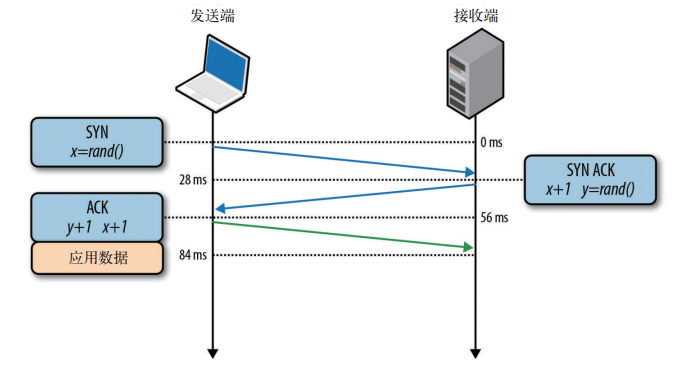

## 第 2 章
**TCP的构成**
因特网有两个核心协议： IP 和 TCP。 IP，即 Internet Protocol（因特网协议），负
责联网主机之间的路由选择和寻址； TCP，即 Transmission Control Protocol（传输
控制协议），负责在不可靠的传输信道之上提供可靠的抽象层。 TCP/IP 也常被称为
“因特网协议套件”（ Internet Protocol Suite），是由 Vint Cerf 和 Bob Khan 在他们
1974 的论文“ A Protocol for Packet Network Intercommunication”（一种分组网络互
通的协议）中首次提出来的。  

最早的建议（ RFC 675）经过几次修订，于 1981 年作为 TCP/IP 标准第 4 版发布。
发布时并不是一个标准，而是两个独立的 RFC：
- RFC 791 —— Internet Protocol；
- RFC 793 —— Transmission Control Protocol。

从那时起， TCP 经过了多次改进和完善，但核心内容变化不大。 TCP 很快取代了之
前的协议，成为 World Wide Web、文件传输、 P2P 等众多流行应用的选择。  

TCP 负责在不可靠的传输信道之上提供可靠的抽象层，向应用层隐藏了大多数网络
通信的复杂细节，比如丢包重发、按序发送、拥塞控制及避免、数据完整，等等。
采用 TCP 数据流可以确保发送的所有字节能够完整地被接收到，而且到达客户端的
顺序也一样。也就是说， TCP 专门为精确传送做了优化，但并未过多顾及时间。正
如稍后我们会谈到的，这一点也给优化浏览器 Web 性能带来了挑战。
HTTP 标准并未规定 TCP 就是唯一的传输协议。如果你愿意，还可以通过 UDP（用
14 ｜ 第 2 章
户数据报协议）或者其他可用协议来发送 HTTP 消息。但在现实当中，由于 TCP 提
供了很多有用的功能，几乎所有 HTTP 流量都是通过 TCP 传送的。  

因此，理解 TCP 的某些核心机制就成为了优化 Web 体验的必修课。虽然我们一般
不会直接使用 TCP 套接口，但应用层的一些决定可能会对 TCP 以及底层网络的性
能产生极大影响。  

##### TCP 和 IP 协议的历史
>我们都知道有 IPv4 和 IPv6，那 IPv1~3 和 IPv5 呢？ IPv4 中的 4 表示 TCP/IP 协议的第 4
个版本，发布于 1981 年 9 月。最初的 TCP/IP 建议中同时包含两个协议，但标准草案
第 4 版将这两个协议分开，使之各自成为独立的 RFC。实际上， IPv4 中的 v4 只是表
明了它与 TCP 前 3 个版本的承继关系，之前并没有单独的 IPv1、 IPv2 或 IPv3 协议。
1994 年，当工作组着手制定 Internet Protocol next generation（ IPng）需要一个新版
本号时， v5 已经被分配给了另一个试验性协议 Internet Stream Protocol（ ST）。但
ST 一直没有什么进展，这也是我们为什么很少听说它的原因。结果 TCP/IP 的下
一版本就成了 IPv6。

### 2.1　三次握手
所有 TCP 连接一开始都要经过三次握手（见图 2-1）。客户端与服务器在交换应用数
据之前，必须就起始分组序列号，以及其他一些连接相关的细节达成一致。出于安
全考虑，序列号由两端随机生成。

- SYN
客户端选择一个随机序列号 x，并发送一个 SYN 分组，其中可能还包括其他 TCP
标志和选项。
- SYN ACK
服务器给 x 加 1，并选择自己的一个随机序列号 y，追加自己的标志和选项，然
后返回响应。
- ACK
客户端给 x 和 y 加 1 并发送握手期间的最后一个 ACK 分组。

三次握手完成后，客户端与服务器之间就可以通信了。客户端可以在发送 ACK 分
组之后立即发送数据，而服务器必须等接收到 ACK 分组之后才能发送数据。这个
启动通信的过程适用于所有 TCP 连接，因此对所有使用 TCP 的应用具有非常大的
性能影响，因为每次传输应用数据之前，都必须经历一次完整的往返。  

举个例子，如果客户端在纽约，服务器在伦敦，要通过光纤启动一次新的 TCP 连
接，光三次握手至少就要花 56 ms（参见表 1-1）：向伦敦发送分组需要 28 ms，响
应发回纽约又要 28 ms。在此，连接的带宽对时间没有影响，延迟完全取决于客户
端和服务器之间的往返时间，这其中主要是纽约到伦敦之间的传输时间。  

三次握手带来的延迟使得每创建一个新 TCP 连接都要付出很大代价。而这也决定了
提高 TCP 应用性能的关键，在于想办法重用连接。  

##### TCP 快速打开
> 遗憾的是，连接并不是想重用就可以重用的。事实上，由于非常短的 TCP 连接在
互联网上随处可见，握手阶段已经成为影响网络总延迟的一个重要因素。为解决
这个问题，人们正在积极寻找各种方案，其中 TFO（ TCP Fast Open， TCP 快速打
开）就是这样一种机制，它致力于减少新建 TCP 连接带来的性能损失。
经过流量分析和网络模拟，谷歌研究人员发现 TFO 平均可以降低 HTTP 事务网络
延迟 15%、整个页面加载时间 10% 以上。在某些延迟很长的情况下，降低幅度甚
至可达 40%。
Linux 3.7 及之后的内核已经在客户端和服务器中支持 TFO，因此成为了客户端和
服务器操作系统选型的有力候选方案。即便如此， TFO 并不能解决所有问题。它
虽然有助于减少三次握手的往返时间，但却只能在某些情况下有效。比如，随同
SYN 分组一起发送的数据净荷有最大尺寸限制、只能发送某些类型的 HTTP 请
求，以及由于依赖加密 cookie，只能应用于重复的连接。 要了解有关 TFO 容量及
局限性的更多细节，请参考 IETF 最新的“ TCP Fast Open”草案。

### 2.2　拥塞预防及控制
1984 年初， John Nagle 提到了一个被称为“拥塞崩溃”的现象，这个现象会影响节
点间带宽容量不对称的任何网络：  

>拥塞控制是复杂网络中众所周知的一个问题。 我们发现国防部的 Internet
Protocol（ IP） —— 纯 粹 的 数 据 报 协 议， 和 Transmission Control Protocol
（ TCP）——传输层协议，在一块使用时，由于传输层与数据报层之间的交互，
会导致一些不常见的拥塞问题。 特别是 IP 网关容易受到我们称为“拥塞崩溃”
现象的严重影响，尤其是在这种网关连接不同带宽的网络时……
可能是往返时间超过了所有主机的最大中断间隔， 于是相应的主机会在网络
中制造越来越多的数据报副本，使得整个网络陷入瘫痪。最终，所有交换节
点的缓冲区都将被填满，多出来的分组必须删掉。目前的分组往返时间已经
设定为最大值。主机会把每个分组都发送好几次，结果每个分组的某个副本
会抵达目标。这就是拥塞崩溃。
这种情况永远存在。 达到饱和状态时，只要选择被删除分组的算法适当，网
络就可以退而求其次地持续运行下去。
*—— John Nagle - RFC 896*

这份报告的结论是拥塞崩溃不会对 ARPANET 造成影响，因为其大多数节点的带
宽相同，而且其骨干网的容量相对大得多。然而，这两种情况没有持续太久。 1986
年，随着加入网络的节点数量（ 5000+）及类型日益增多，该网络中发生了一系列
拥塞崩溃故障。个别情况下，容量下降为千分之一，网络完全瘫痪。

为了解决这些问题， TCP 加入了很多机制，以便控制双向发送数据的速度，比如流
量控制、拥塞控制和拥塞预防机制。

>ARPANET（ Advanced Research Projects Agency Network，高级研究计划局
网络）是现代互联网的前身，是世界上第一个实际运行的分组交换网络。这
个项目于 1959 年正式启动， 1983 年 TCP/IP 作为主要通信协议取代了原来
的 NCP（ Network Control Program）协议。后来呢，那大家就都知道了。
#### 2.2.1　流量控制
流量控制是一种预防发送端过多向接收端发送数据的机制。否则，接收端可能因为
忙碌、负载重或缓冲区既定而无法处理。为实现流量控制， TCP 连接的每一方都要
通告（图 2-2）自己的接收窗口（ rwnd），其中包含能够保存数据的缓冲区空间大小
信息。

第一次建立连接时，两端都会使用自身系统的默认设置来发送 rwnd。浏览网页通常主要是
从服务器向客户端下载数据，因此客户端窗口更可能成为瓶颈。然而，如果是在上传图片
或视频，即客户端向服务器传送大量数据时，服务器的接收窗口又可能成为制约因素。
不管怎样，如果其中一端跟不上数据传输，那它可以向发送端通告一个较小的窗口。
假如窗口为零，则意味着必须由应用层先清空缓冲区，才能再接收剩余数据。这个过
程贯穿于每个 TCP 连接的整个生命周期：每个 ACK 分组都会携带相应的最新 rwnd
值，以便两端动态调整数据流速，使之适应发送端和接收端的容量及处理能力。
##### 窗口缩放（ RFC 1323）
>最初的 TCP 规范分配给通告窗口大小的字段是 16 位的，这相当于设定了发送端和
接收端窗口的最大值（ 216 即 65 535 字节）。结果，在这个限制内经常无法获得最优
性能，特别是在那些“带宽延迟积”（参见 2.3 节“带宽延迟积”）很高的网络中。
为解决这个问题， RFC 1323 提供了“ TCP 窗口缩放”（ TCP Window Scaling）选项，
可以把接收窗口大小由 65 535 字节提高到 1G 字节！缩放 TCP 窗口是在三次握手期
间完成的，其中有一个值表示在将来的 ACK 中左移 16 位窗口字段的位数。
今天， TCP 窗口缩放机制在所有主要平台上都是默认启用的。不过，中间节点和
路由器可以重写，甚至完全去掉这个选项。如果你的服务器或客户端的连接不能
完全利用现有带宽，那往往该先查一查窗口大小。在 Linux 中，可以通过如下命
令检查和启用窗口缩放选项：
- $> sysctl net.ipv4.tcp_window_scaling
- $> sysctl -w net.ipv4.tcp_window_scaling=1

#### 2.2.2　慢启动
尽管 TCP 有了流量控制机制，但网络拥塞崩溃仍然在 1980 年代中后期浮出水面。
流量控制确实可以防止发送端向接收端过多发送数据，但却没有机制预防任何一端
向潜在网络过多发送数据。换句话说，发送端和接收端在连接建立之初，谁也不知
道可用带宽是多少，因此需要一个估算机制，然后还要根据网络中不断变化的条件
而动态改变速度。  

要说明这种动态适应机制的好处，可以想象你在家里观看一个大型的流视频。视频
服务器会尽最大努力根据你的下行连接提供最高品质信息。而此时，你家里又有人
打开一个新连接下载某个软件的升级包。可供视频流使用的下行带宽一下子少了很
多，视频服务器必须调整它的发送速度。否则，如果继续保持同样的速度，那么数
据很快就会在某个中间的网关越积越多，最终会导致分组被删除，从而降低网络传
输效率。  

1988 年， Van Jacobson 和 Michael J. Karels 撰文描述了解决这个问题的几种算法：
慢启动、拥塞预防、快速重发和快速恢复。这 4 种算法很快被写进了 TCP 规范。事
实上，正是由于这几种算法加入 TCP，才让因特网在 20 世纪 80 年代末到 90 年代
初流量暴增时免于大崩溃。  

要理解慢启动，最好看一个例子。同样，假设纽约有一个客户端，尝试从位于伦敦
的服务器上取得一个文件。首先，三次握手，而且在此期间双方各自通过 ACK 分
组通告自己的接收窗口（ rwnd）大小（图 2-2）。在发送完最后一次 ACK 分组后，
就可以交换应用数据了。  

此时，根据交换数据来估算客户端与服务器之间的可用带宽是唯一的方法，而且这
也是慢启动算法的设计思路。首先，服务器通过 TCP 连接初始化一个新的拥塞窗口
（ cwnd）变量，将其值设置为一个系统设定的保守值（在 Linux 中就是 initcwnd）。
- 拥塞窗口大小（ cwnd）
发送端对从客户端接收确认（ ACK）之前可以发送数据量的限制。

发送端不会通告 cwnd 变量，即发送端和接收端不会交换这个值。此时，位于伦敦
的服务器只是维护这么一个私有变量。此时又有一条新规则，即客户端与服务器之
间最大可以传输（未经 ACK 确认的）数据量取 rwnd 和 cwnd 变量中的最小值。那
服务器和客户端怎么确定拥塞窗口大小的最优值呢？毕竟，网络状况随时都在变化，
即使相同的两个网络节点之间也一样（前面的例子已经展示了这一点）。如果能通过
算法来确定每个连接的窗口大小，而不用手工调整就最好了。  

解决方案就是慢启动，即在分组被确认后增大窗口大小，慢慢地启动！最初， cwnd
的值只有 1 个 TCP 段。 1999 年 4 月， RFC 2581 将其增加到了 4 个 TCP 段。 2013
年 4 月， RFC 6928 再次将其提高到 10 个 TCP 段。  

新 TCP 连接传输的最大数据量取 rwnd 和 cwnd 中的最小值，而服务器实际上可以
向客户端发送 4 个 TCP 段，然后就必须停下来等待确认。此后，每收到一个 ACK，
慢启动算法就会告诉服务器可以将它的 cwnd 窗口增加 1 个 TCP 段。每次收到 ACK
后，都可以多发送两个新的分组。 TCP 连接的这个阶段通常被称为“指数增长”阶
段（图 2-3），因为客户端和服务器都在向两者之间网络路径的有效带宽迅速靠拢。

为什么知道有个慢启动对我们构建浏览器应用这么重要呢？因为包括 HTTP 在内的
很多应用层协议都运行在 TCP 之上，无论带宽多大，每个 TCP 连接都必须经过慢
启动阶段。换句话说，我们不可能一上来就完全利用连接的最大带宽！  

相反，我们要从一个相对较小的拥塞窗口开始，每次往返都令其翻倍（指数式增
长）。而达到某个目标吞吐量所需的时间，就是客户端与服务器之间的往返时间和初
始拥塞窗口大小的函数（公式 2-1）。  

公式 2-1： cwnd 大小达到 N 所需的时间

$$ 时间= 往返时间\times  \left \lceil \log_{2}\left ( \frac{N}{初始cwnd} \right )  \right \rceil $$

下面我们就来看一个例子，假设：
- 客户端和服务器的接收窗口为 65 535 字节（ 64 KB）；
- 初始的拥塞窗口： 4 段（ RFC 2581）；
- 往返时间是 56 ms（伦敦到纽约）。

>这里及后面例子中的初始拥塞窗口都会使用原来（ RFC 2581 规定）的 4
段，因为这仍然是目前大多数服务器中常见的值。当然，你肯定不会犯这
种错误的，对吧？接下来的例子能很好地说明为什么你该更新内核了。

先不管 64 KB 的接收窗口，新 TCP 连接的吞吐量一开始是受拥塞窗口初始值限制
的。计算可知，要达到 64 KB 的限制，需要把拥塞窗口大小增加到 45 段，而这需
要 224 ms：

$$\frac{65535字节}{1460字节}\approx 45段$$
$$56ms\times \log _{2}\frac{45}{4}= 224ms$$
要达到客户端与服务器之间 64 KB 的吞吐量，需要 4 次往返（图 2-4），几百 ms 的
延迟！至于客户端与服务器之间实际的连接速率是不是在 Mbit/s 级别，丝毫不影响
这个结果。这就是慢启动。  

为减少增长到拥塞窗口的时间，可以减少客户端与服务器之间的往返时间。比如，
把服务器部署到地理上靠近客户端的地方。要么，就把初始拥塞窗口大小增加到
RFC 9828 规定的 10 段。

慢启动导致客户端与服务器之间经过几百 ms 才能达到接近最大速度的问题，对于
大型流式下载服务的影响倒不显著，因为慢启动的时间可以分摊到整个传输周期内
消化掉。  

可是，对于很多 HTTP 连接，特别是一些短暂、突发的连接而言，常常会出现还没
有达到最大窗口请求就被终止的情况。换句话说，很多 Web 应用的性能经常受到服
务器与客户端之间往返时间的制约。因为慢启动限制了可用的吞吐量，而这对于小
文件传输非常不利。  

##### 慢启动重启
>除了调节新连接的传输速度， TCP 还实现了 SSR（ Slow-Start Restart，慢启动重
启）机制。这种机制会在连接空闲一定时间后重置连接的拥塞窗口。道理很简单，
在连接空闲的同时，网络状况也可能发生了变化，为了避免拥塞，理应将拥塞窗
口重置回“安全的”默认值。
毫无疑问， SSR 对于那些会出现突发空闲的长周期 TCP 连接（比如 HTTP 的
keep-alive 连接）有很大的影响。因此，我们建议在服务器上禁用 SSR。在 Linux
平台，可以通过如下命令来检查和禁用 SSR：
`$> sysctl net.ipv4.tcp_slow_start_after_idle`
`$> sysctl -w net.ipv4.tcp_slow_start_after_idle=0`

为演示三次握手和慢启动对简单 HTTP 传输的影响，我们假设纽约的客户端需要通
过 TCP 连接向伦敦的服务器请求一个 20 KB 的文件（图 2-5），下面列出了连接的
参数。
- 往返时间： 56 ms。
- 客户端到服务器的带宽： 5 Mbit/s。
- 客户端和服务器接收窗口： 65 535 字节。
- 初始的拥塞窗口： 4 段（ 4×1460 字节 ≈ 5.7 KB）。
- 服务器生成响应的处理时间： 40 ms。
- 没有分组丢失、每个分组都要确认、 GET 请求只占 1 段。

- 0 ms：客户端发送 SYN 分组开始 TCP 握手。
- 28 ms：服务器响应 SYN-ACK 并指定其 rwnd 大小。
- 56 ms：客户端确认 SYN-ACK，指定其 rwnd 大小，并立即发送 HTTP GET 请求。
- 84 ms：服务器收到 HTTP 请求。
- 124 ms：服务器生成 20 KB 的响应，并发送 4 个 TCP 段（初始 cwnd 大小为 4），
然后等待 ACK。
- 152 ms：客户端收到 4 个段，并分别发送 ACK 确认。
- 180 ms：服务器针对每个 ACK 递增 cwnd，然后发送 8 个 TCP 段。
- 208 ms：客户端接收 8 个段，并分别发送 ACK 确认。
- 236 ms：服务器针对每个 ACK 递增 cwnd，然后发送剩余的 TCP 段。
- 264 ms：客户端收到剩余的 TCP 段，并分别发送 ACK 确认。

>大家可以练习一下，如果将 cwnd 值设置为 10 个 TCP 段，那么图 2-5 所示
的过程将减少一次往返，性能可以提升 22% ！

通过新 TCP 连接在往返时间为 56 ms 的客户端与服务器间传输一个 20 KB 的文件需
要 264 ms ！作为对比，现在假设客户端可以重用同一个 TCP 连接（图 2-6），再发
送一次相同的请求。

- 0 ms：客户端发送 HTTP 请求。
- 28 ms：服务器收到 HTTP 请求。
- 68 ms：服务器生成 20 KB 响应，但 cwnd 已经大于发送文件所需的 15 段了，因
此一次性发送所有数据段。
- 96 ms：客户端收到所有 15 个段，分别发送 ACK 确认。
同一个连接、同样的请求，但没有三次握手和慢启动，只花了 96 ms，性能提升幅
度达 275% ！

以上两种情况下，服务器和客户端之间的 5 Mbit/s 带宽并不影响 TCP 连接的启动阶
段。此时，延迟和拥塞窗口大小才是限制因素。  

事实上，如果增大往返时间，第一次和第二次请求的性能差距只会加大。大家可以
练习一下，试试不同的往返时间会有什么结果。理解了 TCP 拥塞控制机制后，针对
keep-alive、流水线和多路复用的优化就简单得多了。  

##### 增大 TCP 的初始拥塞窗口
>把服务器的初始 cwnd 值增大到 RFC 6928 新规定的 10 段（ IW10），是提升用户体
验以及所有 TCP 应用性能的最简单方式。好消息是，很多操作系统已经更新了内
核，采用了增大后的值。可以留意相应的文档和发布说明。
在 Linux 上， IW10 是 2.6.39 以上版本内核的新默认值。但不要就此满足，升级到
3.2 以上版本还有其他重要更新，比如 2.2.3 节的“ TCP 比例降速”。
#### 2.2.3　拥塞预防
认识到 TCP 调节性能主要依赖丢包反馈机制非常重要。换句话说，这不是一个假
设命题，而是一个具体何时发生的命题。慢启动以保守的窗口初始化连接，随后的
每次往返都会成倍提高传输的数据量，直到超过接收端的流量控制窗口，即系统
配置的拥塞阈值（ ssthresh）窗口，或者有分组丢失为止，此时拥塞预防算法介入
（图 2-3）。  

拥塞预防算法把丢包作为网络拥塞的标志，即路径中某个连接或路由器已经拥堵了，
以至于必须采取删包措施。因此，必须调整窗口大小，以避免造成更多的包丢失，
从而保证网络畅通。  

重置拥塞窗口后，拥塞预防机制按照自己的算法来增大窗口以尽量避免丢包。某个
时刻，可能又会有包丢失，于是这个过程再从头开始。如果你看到过 TCP 连接的吞
吐量跟踪曲线，发现该曲线呈锯齿状，那现在就该明白为什么了。这是拥塞控制和
预防算法在调整拥塞窗口，进而消除网络中的丢包问题。  

值得一提的是，改进拥塞控制和预防机制既是学术研究的课题，也是商业研发的
方向。毕竟，有那么多不同的网络、不同的数据传输方式需要适应。今天，你的
平台中可能运行着下列诸多 TCP 版本中的一个： TCP Tahoe 和 Reno（最早的实
现）、 TCP Vegas、 TCP New Reno、 TCP BIC、 TCP CUBIC（ Linux 的默认实现）或
Compound TCP（ Windows 的默认实现），等等。然而无论你使用哪一个，拥塞控制
和预防对网络性能的影响都是存在的。  

##### TCP 比例降速
>确定丢包恢复的最优方式并不容易。如果太激进，那么间歇性的丢包就会对整个
连接的吞吐量造成很大影响。而如果不够快，那么还会继续造成更多分组丢失。
最初， TCP 使用 AIMD（ Multiplicative Decrease and Additive Increase，倍减加增）
算法，即发生丢包时，先将拥塞窗口减半，然后每次往返再缓慢地给窗口增加一
个固定的值。不过，很多时候 AIMD 算法太过保守，因此又有了新的算法。  
PRR（ Proportional Rate Reduction，比例降速）就是 RFC 6937 规定的一个新算法，
其目标就是改进丢包后的恢复速度。改进效果如何呢？根据谷歌的测量，实现新
算法后，因丢包造成的平均连接延迟减少了 3%~10%。  
PRR 现在是 Linux 3.2+ 内核默认的拥塞预防算法。这又是你升级服务器的一个
理由！
### 2.3　带宽延迟积
TCP 内置的拥塞控制和预防机制对性能还有另一个重要影响：发送端和接收端理想
的窗口大小，一定会因往返时间及目标传输速率而变化。  

为什么？我们知道，发送端和接收端之间在途未确认的最大数据量，取决于拥塞窗
口（ cwnd）和接收窗口（ rwnd）的最小值。接收窗口会随每次 ACK 一起发送，而
拥塞窗口则由发送端根据拥塞控制和预防算法动态调整。  

无论发送端发送的数据还是接收端接收的数据超过了未确认的最大数据量，都必须停
下来等待另一方 ACK 确认某些分组才能继续。要等待多长时间呢？取决于往返时间！
- BDP（ Bandwidth-delay product， 带宽延迟积）  
数据链路的容量与其端到端延迟的乘积。这个结果就是任意时刻处于在途未确认
状态的最大数据量。

发送端或接收端无论谁被迫频繁地停止等待之前分组的 ACK，都会造成数据缺口
（图 2-7），从而必然限制连接的最大吞吐量。为解决这个问题，应该让窗口足够大，
以保证任何一端都能在 ACK 返回前持续发送数据。只有传输不中断，才能保证最
大吞吐量。而最优窗口大小取决于往返时间！无论实际或通告的带宽是多大，窗口
过小都会限制连接的吞吐量。

那么，流量控制窗口（ rwnd）和拥塞控制窗口（ cwnd）的值多大合适呢？实际上，计
算过程很简单。首先，假设 cwnd 和 rwnd 的最小值为 16 KB，往返时间为 100 ms：
$$16KB= (16\times1024 \times8 )=131072bit$$
$$\frac{131072 bit}{0.1s}=1 310 720 bit/s$$
$$1 310 720 bit/s=\frac{131072}{1 000 000}=1.31Mbit/s$$
不管发送端和接收端的实际带宽多大，这个 TCP 连接的数据传输速率不会超过 1.31
Mbit/s ！想提高吞吐量，要么增大最小窗口值，要么减少往返时间。

类似地，知道往返时间和两端的实际带宽也可以计算最优窗口大小。这一次我们
假设往返时间不变（还是 100 ms），发送端的可用带宽为 10 Mbit/s，接收端则为
100 Mbit/s+。还假设两端之间没有网络拥塞，我们的目标就是充分利用客户端的 10
Mbit/s 带宽：
$$10 Mbit/s = 10 × 1 000 000 = 10 000 000 bit /s$$
$$10 000 000 bit /s=\frac{10 000 000}{8\times 1024}=1221KB/s$$
$$1221 KB / s × 0.1 s = 122.1 KB$$
窗口至少需要 122.1 KB 才能充分利用 10 Mbit/s 带宽！还记得吗，如果没有“窗口
缩放（ RFC 1323）”， TCP 接收窗口最大只有 64 KB。是不是该好好查查自己的客户
端和服务器设置啦？  

好在窗口大小的协商与调节由网络栈自动控制，应该会自动调整。但尽管如此，窗
口大小有时候仍然是 TCP 性能的限制因素。如果你怎么也想不通在高速连接的客户
端与服务器之间，实际传输速度只有可用带宽的几分之一，那窗口大小很可能就是
罪魁祸首。要么因为某一饱和端通告的接收窗口很小，要么因为网络拥堵和丢包导
致拥塞窗口重置，更可能因为流量增长过快导致对连接吞吐量施加了限制。  

##### 高速局域网中的带宽延迟积
>BDP 是往返时间和目标传输速度的函数。因此，往返时间不仅在高传输延迟中是
一个常见的瓶颈，就算在 LAN 中也可能是一个瓶颈！
要想在 1 ms 的往返时间内达到 1 GBit/s 的传输速度，拥塞窗口同样至少要有 122
KB。计算过程与前面类似，只不过要给目标速度多加几个零，再从往返时间中拿
掉同样多个零而已。

### 2.4　队首阻塞
TCP 在不可靠的信道上实现了可靠的网络传输。基本的分组错误检测与纠正、按
序交付、丢包重发，以及保证网络最高效率的流量控制、拥塞控制和预防机制，让
TCP 成为大多数网络应用中最常见的传输协议。  

虽然 TCP 很流行，但它并不是唯一的选择，而且在某些情况下也不是最佳的选择。
特别是按序交付和可靠交付有时候并不必要，反而会导致额外的延迟，对性能造成
负面影响。  

要理解为什么，可以想一想，每个 TCP 分组都会带着一个唯一的序列号被发出，而
所有分组必须按顺序传送到接收端（图 2-8）。如果中途有一个分组没能到达接收
端，那么后续分组必须保存在接收端的 TCP 缓冲区，等待丢失的分组重发并到达接
收端。这一切都发生在 TCP 层，应用程序对 TCP 重发和缓冲区中排队的分组一无所
知，必须等待分组全部到达才能访问数据。在此之前，应用程序只能在通过套接字
读数据时感觉到延迟交付。这种效应称为 TCP 的队首（ HOL， Head of Line）阻塞。  

队首阻塞造成的延迟可以让我们的应用程序不用关心分组重排和重组，从而让代码
保持简洁。然而，代码简洁也要付出代价，那就是分组到达时间会存在无法预知的
延迟变化。这个时间变化通常被称为抖动，也是影响应用程序性能的一个主要因素。
另外，有些应用程序可能并不需要可靠的交付或者不需要按顺序交付。比如，每个
分组都是独立的消息，那么按顺序交付就没有任何必要。而且，如果每个消息都会
覆盖之前的消息，那么可靠交付同样也没有必要了。可惜的是， TCP 不支持这种情
况，所有分组必须按顺序交付。  

无需按序交付数据或能够处理分组丢失的应用程序，以及对延迟或抖动要求很高的
应用程序，最好选择 UDP 等协议。  

##### 丢包就丢包
>事实上，丢包是让 TCP 达到最佳性能的关键。被删除的包恰恰是一种反馈机制，
能够让接收端和发送端各自调整速度，以避免网络拥堵，同时保持延迟最短（参
见 1.2 节的“本地路由器的缓冲区爆满”）。另外，有些应用程序可以容忍丢失一
定数量的包，比如语音和游戏状态通信，就不需要可靠传输或按序交付。
就算有个包丢了，音频编解码器只要在音频中插入一个小小的间歇，就可以继续
处理后来的包。只要间歇够小，用户就注意不到，而等待丢失的包则可能导致音
频输出产生无法预料的暂停。相对来说，后者的用户体验更糟糕。
类似地，更新 3D 游戏中角色的状态也一样：收到 T 时刻的包而等待 T-1 时刻的
包通常毫无必要。理想情况下，应该可以接收所有状态更新，但为避免游戏延迟，
间歇性的丢包也是可以接受的。
### 2.5　针对TCP的优化建议
TCP 是一个自适应的、对所有网络节点一视同仁的、最大限制利用底层网络的协
议。因此，优化 TCP 的最佳途径就是调整它感知当前网络状况的方式，根据它之上
或之下的抽象层的类型和需求来改变它的行为。无线网络可能需要不同的拥塞算法，
而某些应用程序可能需要自定义服务品质（ QoS， Quality of Service）的含义，从而
交付最佳的体验。  

不同应用程序需求间的复杂关系，以及每个 TCP 算法中的大量因素，使得 TCP 调优
成为学术和商业研究的一个“无底洞”。本章只蜻蜓点水般地介绍了影响 TCP 性能
的几个典型因素，而没有探讨的选择性应答（ SACK）、延迟应答、快速转发等，随
便一个都能让你领略到 TCP 的复杂性（或者乐趣），感受到理解、分析和调优之难。
尽管如此，而且每个算法和反馈机制的具体细节可能会继续发展，但核心原理以及
它们的影响是不变的：  

- TCP 三次握手增加了整整一次往返时间；
- TCP 慢启动将被应用到每个新连接；
- TCP 流量及拥塞控制会影响所有连接的吞吐量；
- TCP 的吞吐量由当前拥塞窗口大小控制。

结果，现代高速网络中 TCP 连接的数据传输速度，往往会受到接收端和发送端之
间往返时间的限制。另外，尽管带宽不断增长，但延迟依旧受限于光速，而且已经
限定在了其最大值的一个很小的常数因子之内。大多数情况下， TCP 的瓶颈都是延
迟，而非带宽（参见图 2-5）。  

#### 2.5.1　服务器配置调优
在着手调整 TCP 的缓冲区、超时等数十个变量之前，最好先把主机操作系统升级到
最新版本。 TCP 的最佳实践以及影响其性能的底层算法一直在与时俱进，而且大多
数变化都只在最新内核中才有实现。一句话，让你的服务器跟上时代是优化发送端
和接收端 TCP 栈的首要措施。  

>表面看来，升级服务器内核到最新版本好像是件易如反掌的事儿。但在实
践中，升级经常会遭遇阻力。很多现有服务器已经针对特定的内核版本进
行了调优，而系统管理员并不情愿升级。  

实事求是地讲，每一次升级都有相应的风险。但为了获得最大的 TCP 性
能，升级恐怕也是唯一最佳的选择。  

有了最新的内核，我们推荐你遵循如下最佳实践来配置自己的服务器。
- 增大TCP的初始拥塞窗口
加大起始拥塞窗口可以让 TCP 在第一次往返就传输较多数据，而随后的速度提
升也会很明显。对于突发性的短暂连接，这也是特别关键的一个优化。
- 慢启动重启
在连接空闲时禁用慢启动可以改善瞬时发送数据的长 TCP 连接的性能。
- 窗口缩放（ RFC 1323）
启用窗口缩放可以增大最大接收窗口大小，可以让高延迟的连接达到更好吞
吐量。
- TCP快速打开
在某些条件下，允许在第一个 SYN 分组中发送应用程序数据。 TFO（ TCP Fast
Open， TCP 快速打开）是一种新的优化选项，需要客户端和服务器共同支持。
为此，首先要搞清楚你的应用程序是否可以利用这个特性。

以上几个设置再加上最新的内核，可以确保最佳性能：每个 TCP 连接都会具有较低
的延迟和较高的吞吐量。
视应用程序的类型，可能还有必要调整服务器上的其他 TCP 设置，以便优化高速连
接的速度、内存占用，或者其他类似的关键选项。不过，这些系统配置与平台、应
用程序、硬件有关，超出了本书讨论范围；必要时，可以参考平台文档。但更重要
的是要分清轻重缓急，着力解决真正的瓶颈，而不是眉毛胡子一把抓。

>Linux 用户可以使用 ss 来查看当前打开的套接字的各种统计信息。在命令
行里运行 ss --options --extended --memory --processes --info，可以看
到当前通信节点以及它们相应的连接设置。
#### 2.5.2　应用程序行为调优

调优 TCP 性能可以让服务器和客户端之间达到最大吞吐量和最小延迟。而应用程序
如何使用新的或已经建立的 TCP 连接同样也有很大的关系。
- 再快也快不过什么也不用发送，能少发就少发。
- 我们不能让数据传输得更快，但可以让它们传输的距离更短。
- 重用 TCP 连接是提升性能的关键。

当然，消除不必要的数据传输本身就是很大的优化。比如，减少下载不必要的资源，
或者通过压缩算法把要发送的比特数降到最低。然后，通过在不同的地区部署服务
器（比如，使用 CDN），把数据放到接近客户端的地方，可以减少网络往返的延迟，
从而显著提升 TCP 性能。最后，尽可能重用已经建立的 TCP 连接，把慢启动和其
他拥塞控制机制的影响降到最低。
#### 2.5.3　性能检查清单
优化 TCP 性能的回报是丰厚的，无论什么应用，性能提升可以在与服务器的每个连
接中体现出来。下面几条请大家务必记在自己的日程表里：
- 把服务器内核升级到最新版本（ Linux： 3.2+）；
- 确保 cwnd 大小为 10；
- 禁用空闲后的慢启动；
- 确保启动窗口缩放；
- 减少传输冗余数据；
- 压缩要传输的数据；
- 把服务器放到离用户近的地方以减少往返时间；
- 尽最大可能重用已经建立的 TCP 连接。